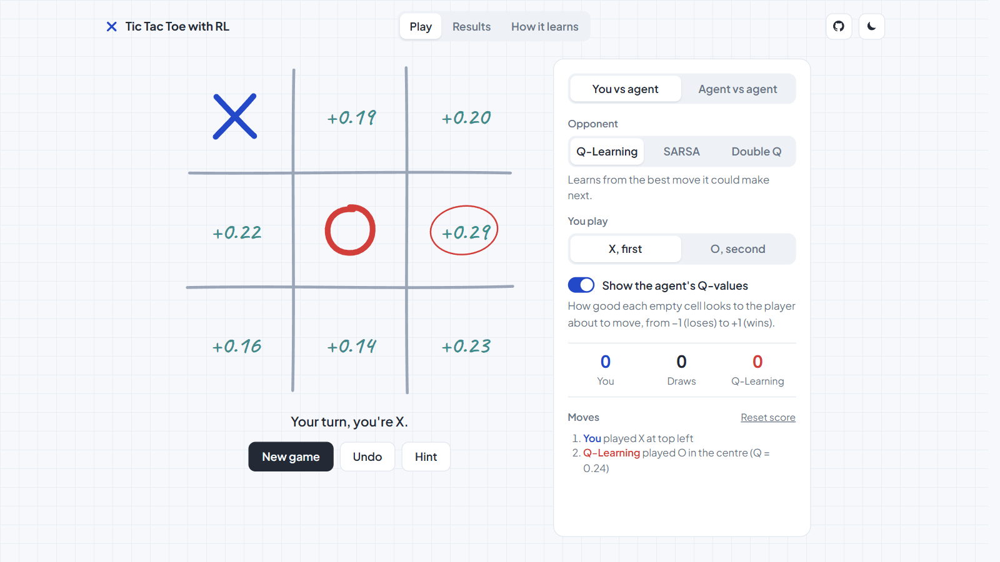
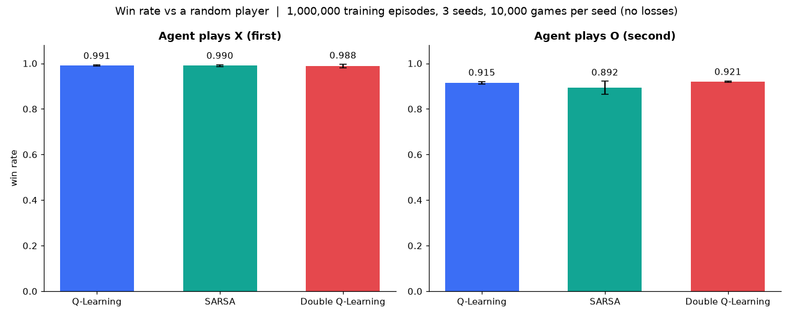
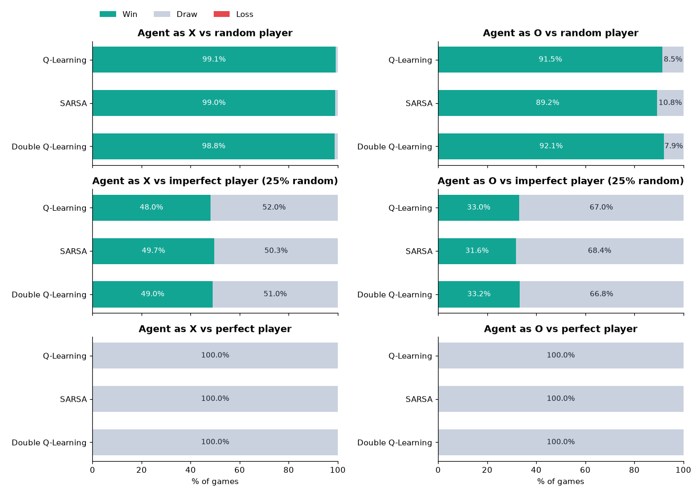
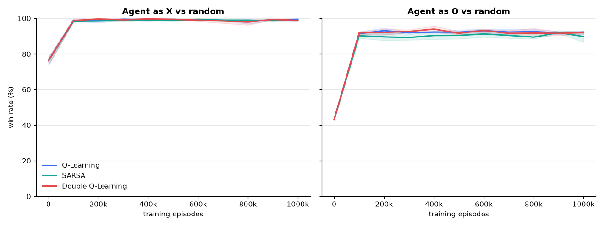

# Tic Tac Toe with RL

Agents that learn Tic Tac Toe by self-play, with a browser demo to play against them.



| | Classic 3×3 | 4×4 FIFO |
| --- | --- | --- |
| Rules | three in a row | four in a line; each player keeps 4 marks, a 5th removes the oldest; draw after 100 moves |
| Agents | Q-Learning, SARSA, Double Q-Learning (tables) | Deep Q-Learning + 3-move look-ahead |
| Training | 1,000,000 games each | 2,000,000 games |
| Result | never loses; draws perfect play | never loses (0 of 100,000 test games) |
| Page | `web/index.html` | `web/fifo.html` |

## Quick start

```
pip install -r requirements.txt   # matplotlib, for the charts
pip install torch                 # only to train / evaluate FIFO
python demo.py                    # opens http://127.0.0.1:8000
```

Both pages have three tabs:

- **Play**: you vs agent or agent vs agent, show the agent's scores, hint, undo.
- **Results**: win / draw / loss per opponent and the training curve.
- **How it learns / How it works**: interactive step-by-step walkthrough.

Keyboard (3×3): `1`-`9` play a cell, `N` new game, `U` undo, `H` hint.
`web/` is static and can be hosted as-is (e.g. GitHub Pages).

## Project structure

```
├── env/Environment.py   3×3 rules
├── RL_Agent/            3×3 agents: tabular.py, QLearning.py, SARSA.py, DoubleQLearning.py, DeepQLearning.py
├── trainer.py           train (add --game fifo for FIFO)
├── evaluate.py          test + results (add --game fifo for FIFO)
├── play.py              play 3×3 in the terminal
├── plots.py             README charts
├── evaluate.ipynb       results notebook
├── demo.py              start the web demo
├── fifo/                4×4 FIFO: game.py (rules), dqn.py (Deep Q agent), cli.py, style.py
├── save/                3×3 models; save/fifo/ FIFO model
├── web/                 browser demo (no build step), published to GitHub Pages
│   ├── index.html       3×3 page
│   ├── fifo.html        4×4 FIFO page
│   ├── css/             styles.css (shared), fifo.css
│   ├── js/shared/       tabs, theme, hand-drawn marks
│   ├── js/classic/      3×3 game, app, learning walkthrough
│   ├── js/fifo/         4×4 game, network + look-ahead, Play / Results / How it works tabs
│   ├── data/            trained models and results the pages load
│   └── tests/           JavaScript tests (not published)
├── img/                 README images
├── tests/               Python tests
└── .github/workflows/   GitHub Pages deploy
```

## Classic 3×3

### Commands

```
python play.py -a QLearning               # QLearning | SARSA | DoubleQLearning | DeepQLearning
python play.py -a SARSA -ep 50000         # train first, then play
python trainer.py -a QLearning -ep 100000
python evaluate.py                        # train all, test, write charts
```

### Algorithms

- **Q-Learning**: learns from the best next move (off-policy).
- **SARSA**: learns from the move actually played next (on-policy, more careful).
- **Double Q-Learning**: two tables, one picks the next move, the other scores it.
- **Deep Q-Learning** (optional, PyTorch): small network, replay buffer, target network. Not in the results.

### Results

1,000,000 training games × 3 seeds, then 10,000 test games per seed.
Opponents: **random**, **imperfect** (perfect play, 25% random moves), **perfect** (minimax).

| Algorithm | Plays | vs random | vs imperfect | vs perfect |
| --- | --- | ---: | ---: | ---: |
| Q-Learning | X | 99.08% | 48.02% | all draws |
| Q-Learning | O | 91.53% | 33.04% | all draws |
| SARSA | X | 99.01% | 49.66% | all draws |
| SARSA | O | 89.25% | 31.64% | all draws |
| Double Q-Learning | X | 98.80% | 48.98% | all draws |
| Double Q-Learning | O | 92.09% | 33.21% | all draws |

- No agent lost a game. Agent vs agent: 27/27 draws.
- Best possible vs imperfect without risking a loss: 50.8% as X, 33.1% as O (exact expectimax).
- On every board, every agent takes a win and blocks a threat unless already lost (`tests/test_core.py`).
- Training takes 20–30 s per 1,000,000 games on a laptop CPU.





### Training settings

| Setting | Value |
| --- | --- |
| Rewards | win +1, loss −1, draw 0 |
| Learning rate / discount | 0.1 / 0.8 |
| Exploration ε | 1.0 → 0.2 over the first 80% |
| Update | after the opponent replies; only empty cells count |
| Options | `--win-reward`, `--draw-reward`, `--epsilon`, `--alpha`, `--gamma` |

## 4×4 FIFO

### Rules

- Four in a row, column or full diagonal wins.
- Each player keeps 4 marks; a 5th mark removes that player's oldest first.
- The oldest mark's square can't be chosen until it's gone.
- Draw after 100 moves.

### Agent

| Part | Value |
| --- | --- |
| Input | 129 numbers: each side's marks in 4 grids by turns until removed, + moves left |
| Network | 129 → 256 → 256 → 16 (ReLU), 103,184 weights, one score per square |
| Training | self-play, one network for X and O, Double DQN, replay buffer, target network, 8 board symmetries |
| Target | score a move on the same player's next turn: ±1 / 0 at game end, else 0.9 × best score |
| Exploration | ε 1.0 → 0.2 over the first half (opponent slips, so traps pay off) |
| Play | 3-move look-ahead (all moves, replies, next moves), network judges the end positions |

### Results

2,000,000 training games (18 min on an RTX 4070 SUPER). 10,000 test games as X + 10,000 as O, with look-ahead:

| Opponent | Wins | Draws | Losses |
| --- | ---: | ---: | ---: |
| random | 20,000 | 0 | 0 |
| tactical (takes wins, avoids handing one over) | 20,000 | 0 | 0 |
| human-like (itself, 10% random moves) | 13,817 | 6,183 | 0 |
| itself | 0 | 20,000 | 0 |

- 0 losses in 20,000 more games vs other strong networks searching 2–3 moves.
- Perfect play draws, as in 3×3.
- A Q-table can't learn FIFO: after 400,000 games it played like random.

### Commands

```
python trainer.py --game fifo -ep 2000000 --checkpoint-every 250000 --curve-games 500
python trainer.py --game fifo -ep 200000 --resume
python evaluate.py --game fifo --games 10000 --opponents random tactical --depth 3
python -m fifo.style --games 2000 --depth 3
```

| Output | Path |
| --- | --- |
| Model | `save/fifo/DeepQLearning.pt` |
| Detailed report | `save/fifo/evaluation.json` |
| Browser model / results | `web/data/FIFO-DeepQLearning.json`, `web/data/fifo-evaluation.json` |

Options: `--alpha` (3e-4), `--gamma` (0.9), `--epsilon` (0.2), `--parallel` (1024), `--seed`, `--depth` (0–4), `--no-export`, `--save-dir`, `--web-dir`, `--model`, `--output`.

## Tests

```
node --test web/tests/*.test.js
python -m unittest discover -s tests          # FIFO Deep Q tests need PyTorch
```
